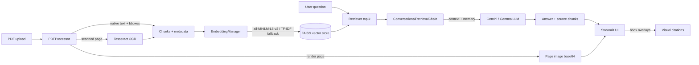

# 📚 PDF Chat Assistant — RAG over your documents

A production-style **Retrieval-Augmented Generation (RAG)** chatbot that answers
questions grounded in your own PDF documents — including **scanned PDFs** via OCR —
and shows you *exactly where* each answer came from with **visual citation
highlighting** on the original page.

Built with **LangChain**, **Google Gemini**, **FAISS**, **PyMuPDF**, **Tesseract OCR**,
and **Streamlit**. Containerized and deployed to Hugging Face Spaces.

**🔗 Live demo:** https://sharath32-pdf-chatbot-rag.hf.space

---

## Demo

https://github.com/user-attachments/assets/a4607370-360f-432a-8dec-4b19ca6e4d99

> Upload PDFs → ask questions → get grounded answers with the source page region highlighted.
> Try it live at **[sharath32-pdf-chatbot-rag.hf.space](https://sharath32-pdf-chatbot-rag.hf.space)**.

---

## Why this project is interesting

Most "chat with your PDF" demos stop at *extract text → embed → retrieve → answer*.
This one goes further and handles the parts that actually matter in production:

- **Scanned / image-only PDFs** are detected per-page and run through **OCR**, so the
  chatbot works on documents that have no embedded text layer.
- **Visual, verifiable citations.** Instead of dumping a text snippet, the UI renders the
  original page image and overlays bounding boxes on the exact regions the answer was
  drawn from — turning "trust me" into "see for yourself."
- **Graceful degradation everywhere.** If the embedding model can't load, it falls back to
  TF-IDF. If the RAG chain fails, it falls back to direct generation with retries. If the
  LLM is rate-limited, requests are throttled and retried.

---

## Features

| Capability | Details |
|---|---|
| **Native + scanned PDFs** | PyMuPDF extracts text blocks with bounding boxes; pages with little/no text are rendered and OCR'd with Tesseract. |
| **Visual citation highlighting** | Each cited chunk maps back to bounding boxes on a rendered page image, shown as red overlays in the UI. |
| **Semantic retrieval** | Chunks embedded with `sentence-transformers/all-MiniLM-L6-v2` and indexed in a FAISS vector store. |
| **TF-IDF fallback** | If the transformer model fails to load (e.g. meta-tensor errors on constrained hosts), a scikit-learn TF-IDF embedding keeps the app usable. |
| **Conversational memory** | Multi-turn chat with context retention via LangChain `ConversationBufferMemory`. |
| **LLM via LangChain** | Answers from Google Gemini / Gemma (`ChatGoogleGenerativeAI`), wired through a `ConversationalRetrievalChain`. |
| **Resilient generation** | Automatic fallback to direct generation + retry logic + rate-limit throttling. |
| **Fully configurable** | Model, chunk size/overlap, top-k, temperature, and token limits via `.env` / `src/config.py`. |
| **Containerized** | Dockerfile with Tesseract preinstalled; deploys to Hugging Face Spaces on port 7860. |

---

## Architecture



### Module layout

| File | Responsibility |
|---|---|
| `app.py` | Streamlit UI, session state, upload/process flow, citation rendering |
| `src/processor.py` | PDF text/block extraction (PyMuPDF), OCR fallback (Tesseract), page rendering, chunking with bbox metadata |
| `src/embedding.py` | Embedding model (SentenceTransformers, TF-IDF fallback), FAISS index, retriever |
| `src/chat.py` | LLM init, RAG chain, conversational memory, fallback generation |
| `src/config.py` | Centralized config with environment-variable overrides |
| `Dockerfile` | Container image with Tesseract + system deps for HF Spaces |

---

## Tech stack

- **Orchestration:** LangChain (`langchain`, `langchain-community`, `langchain-google-genai`)
- **LLM:** Google Gemini / Gemma via `ChatGoogleGenerativeAI`
- **Embeddings:** Sentence Transformers (`all-MiniLM-L6-v2`), scikit-learn TF-IDF fallback
- **Vector store:** FAISS (CPU)
- **PDF & OCR:** PyMuPDF (fitz), Pillow, Tesseract (`pytesseract`)
- **UI:** Streamlit
- **Packaging:** Docker, Hugging Face Spaces

---

## Getting started

### Prerequisites

- Python 3.10+
- A **Google Gemini API key** ([get one here](https://aistudio.google.com/app/apikey))
- **Tesseract OCR** (only needed for scanned PDFs):
  ```bash
  # Debian/Ubuntu
  sudo apt-get install tesseract-ocr
  # Arch
  sudo pacman -S tesseract tesseract-data-eng
  # macOS
  brew install tesseract
  ```

### Local setup

```bash
git clone git@github.com:ki11e6/pdf-chatbot-rag.git
cd pdf-chatbot-rag

python -m venv .venv
source .venv/bin/activate        # Windows: .venv\Scripts\activate

pip install -r requirements.txt

cp .env.example .env             # then add your API key
streamlit run app.py
```

The app opens at `http://localhost:8501`.

### Configuration

All settings have sensible defaults and can be overridden in `.env`:

| Variable | Default | Description |
|---|---|---|
| `GEMINI_API_KEY` | _(required)_ | Google Gemini API key |
| `MODEL_NAME` | `gemma-3-27b-it` | LLM model name |
| `EMBEDDING_MODEL` | `sentence-transformers/all-MiniLM-L6-v2` | Embedding model |
| `CHUNK_SIZE` | `1000` | Characters per chunk |
| `CHUNK_OVERLAP` | `200` | Overlap between chunks |
| `TOP_K` | `4` | Chunks retrieved per query |
| `LLM_TEMPERATURE` | `0.7` | Sampling temperature |
| `MAX_TOKENS` | `2048` | Max output tokens |

---

## Usage

1. Upload one or more PDFs in the sidebar.
2. Click **Process Documents** to extract, chunk, and embed them.
3. Ask questions in the chat — answers cite the source page, and you can expand each
   citation to see the highlighted region on the original page.
4. **Clear Conversation** resets chat memory; **Clear File Chunks** drops the index.

---

## Run with Docker

```bash
docker build -t pdf-chat-assistant .
docker run -p 7860:7860 -e GEMINI_API_KEY=your-key pdf-chat-assistant
```

Open `http://localhost:7860`. The image installs Tesseract and English language data,
so OCR works out of the box.

> Deployed on Hugging Face Spaces using this same Dockerfile (port 7860, with a
> `/_stcore/health` healthcheck).

---

## Design notes & trade-offs

- **Bounding-box citations** are computed at processing time and carried as chunk
  metadata, so retrieval stays a pure vector lookup while the UI still has everything it
  needs to highlight sources — no second pass over the PDF.
- **OCR is conditional** (triggered only when a page yields < 50 chars of native text) to
  avoid paying the OCR cost on text-native documents.
- **In-memory FAISS** keeps the project simple and self-contained; swapping in a persistent
  store (e.g. Chroma, pgvector) is isolated to `src/embedding.py`.
- **Rate-limit throttling** (2s spacing) targets free-tier Gemma limits (~30 RPM); tune for
  your quota.

---

## Possible extensions

- Persistent vector store + document library across sessions
- Streaming token responses
- Reranking retrieved chunks before generation
- Multi-language OCR
- Evaluation harness (faithfulness / answer-relevance metrics)

---

## License

Released under the [MIT License](LICENSE).
